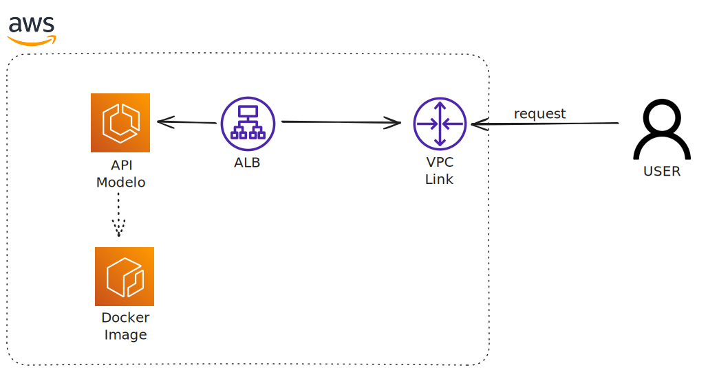

# fiap-mlet-api-fase4

## Visão Geral

Este projeto faz parte da entrega da disciplina de Machine Learning Engineering da FIAP, com o objetivo de construir, treinar e disponibilizar uma API para predição de séries temporais utilizando redes neurais LSTM (Long Short-Term Memory). O foco principal está na construção do modelo, desde a preparação dos dados até a implementação e disponibilização do modelo treinado.

<p align="center">
  
</p>

## Estrutura do Projeto

```plaintext
fiap-mlet-api-fase4/
│
├── modelo-app/
│   ├── Model/
│   │   ├── busca_hiperparametros_lstm.ipynb
│   │   └── lstm.ipynb
│   └── src/
│       ├── Dockerfile
│       ├── modelo_lstm_acao.h5
│       ├── requirements.txt
│       └── run.py
├── .gitignore
└── README.md
```

- **Model/**: Notebooks de desenvolvimento e experimentação do modelo LSTM.  
- **src/**: Código fonte da API, modelo treinado, dependências e Dockerfile para deploy.


## Construção do Modelo


1. **Preparação dos Dados**
   - Realizada nos notebooks presentes em `Model/`.
   - Os dados foram tratados, normalizados e estruturados em janelas temporais para alimentar a rede LSTM, que é especialmente eficaz para problemas de séries temporais devido à sua capacidade de capturar dependências de longo prazo.

2. **Busca de Hiperparâmetros**
   - O notebook `busca_hiperparametros_lstm.ipynb` explora diferentes configurações de hiperparâmetros, como número de camadas, unidades LSTM, taxa de aprendizado e batch size, utilizando técnicas de validação cruzada para encontrar a melhor combinação para o problema.

3. **Treinamento do Modelo**
   - O notebook `lstm.ipynb` contém o pipeline de treinamento do modelo LSTM, incluindo:
     - Definição da arquitetura da rede (camadas LSTM, Dropout, Dense).
     - Compilação do modelo com função de perda adequada (ex: MSE) e otimizador (ex: Adam).
     - Treinamento e avaliação do desempenho em dados de validação.
     - Salvamento do modelo treinado em `modelo_lstm_acao.h5`.

4. **Disponibilização via API**
   - O arquivo `run.py` implementa uma API (usando Flask) que carrega o modelo treinado e expõe endpoints para receber dados de entrada e retornar previsões.
   - O deploy pode ser realizado via Docker, conforme especificado no `Dockerfile`.


## Como Executar

1. **Instale as dependências:**
   ```bash
   pip install -r requirements.txt
   ```

2. **Execute a API:**
   ```bash
   python run.py
   ```

3. **Deploy via Docker:**
   ```bash
   docker build -t fiap-mlet-api-fase4 .
   docker run -p 5000:5000 fiap-mlet-api-fase4
   ```


curl -X GET http://localhost:5000/predict \
     -H "Content-Type: application/json" \
     -d "{\"data\": [10.5, 11.2, 12.0, 13.1, 14.0, 15.2, 16.3, 17.1, 18.0, 19.2]}"

## Manual de Uso da API

A API está disponível após a execução do arquivo `run.py` e expõe dois endpoints principais:

### 1. `/predict`
- **Método:** `GET`
- **Descrição:** Recebe uma sequência de valores numéricos e retorna a previsão do próximo valor da série temporal.

#### **Input esperado**
Envie um JSON no corpo da requisição com o campo `data`, que deve ser uma lista de números (floats ou inteiros).

Exemplo de corpo da requisição:
```json
{
  "data": [120.5, 121.0, 119.8, 122.3, 123.1, 124.0, 125.2, 126.5, 127.0, 128.3, 129.1, 130.0, 131.2, 132.5, 133.0, 134.3, 135.1, 136.0, 137.2, 138.5, 139.0, 140.3, 141.1, 142.0, 143.2, 144.5, 145.0, 146.3, 147.1, 148.0, 149.2, 150.5, 151.0, 152.3, 153.1, 154.0, 155.2, 156.5, 157.0, 158.3, 159.1, 160.0, 161.2, 162.5, 163.0, 164.3, 165.1, 166.0, 167.2, 168.5, 169.0, 170.3, 171.1, 172.0, 173.2, 174.5, 175.0, 176.3, 177.1, 178.0]
}
```
> **Observação:** O tamanho mínimo da lista deve ser igual ao parâmetro `seq_length` utilizado no treinamento do modelo (no caso 60).

#### **Resposta esperada**
Retorna um JSON com a previsão:
```json
{
  "prediction": 20.1
}
```
Se o input for inválido ou insuficiente, retorna um erro:
```json
{
  "error": "Input data must have at least 60 values"
}
```

#### **Exemplo de chamada usando `curl`**
```bash
curl -X GET http://lb-modelo-101509015.sa-east-1.elb.amazonaws.com/predict \
     -H "Content-Type: application/json" \
     -d "{\"data\": [120.5, 121.0, 119.8, 122.3, 123.1, 124.0, 125.2, 126.5, 127.0, 128.3, 129.1, 130.0, 131.2, 132.5, 133.0, 134.3, 135.1, 136.0, 137.2, 138.5, 139.0, 140.3, 141.1, 142.0, 143.2, 144.5, 145.0, 146.3, 147.1, 148.0, 149.2, 150.5, 151.0, 152.3, 153.1, 154.0, 155.2, 156.5, 157.0, 158.3, 159.1, 160.0, 161.2, 162.5, 163.0, 164.3, 165.1, 166.0, 167.2, 168.5, 169.0, 170.3, 171.1, 172.0, 173.2, 174.5, 175.0, 176.3, 177.1, 178.0]}"
```

---

### 2. `/health-check`
- **Método:** `POST`
- **Descrição:** Verifica se a API está ativa.

#### **Resposta esperada**
```json
{
  "status": "healthy"
}
```
---

## Considerações Finais

O projeto demonstra a aplicação prática de técnicas de Deep Learning para previsão de séries temporais, desde a experimentação e ajuste do modelo até a entrega de uma solução pronta para produção. O uso de LSTM foi motivado pela sua robustez em capturar padrões temporais complexos, tornando-o adequado para aplicações financeiras, previsão de demanda, entre outros cenários.
